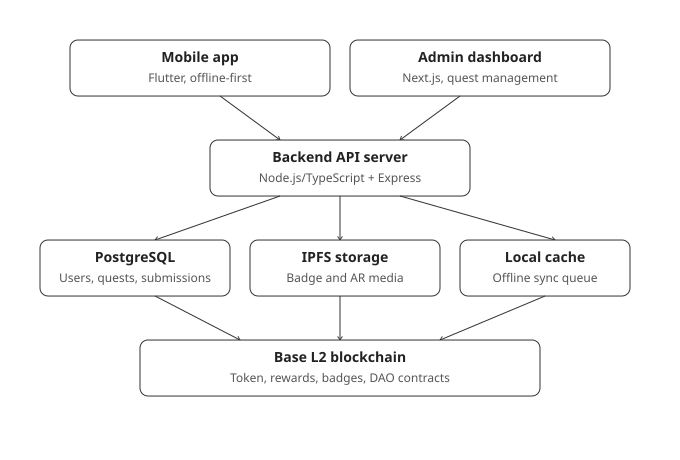
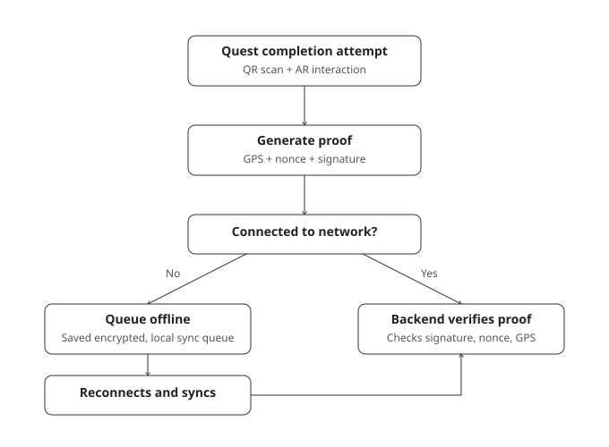
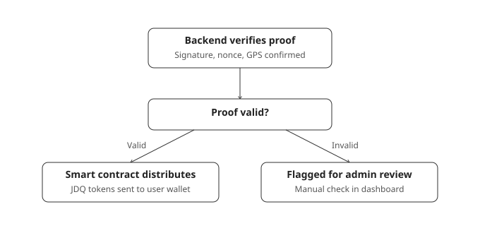

# JuanDerQuest: A Gamified Blockchain-based System for Promoting Tourist Destinations in Pangasinan

## System Development Proposal

**Prepared by:** Ana Victoria V. Alentajan, Zernan Vash L. Arive, Clarissa Angel A. Gutlay, Carl Jacob Lavaro, Alyana Soriano  
**Institution:** School of Information Technology Education, Universidad de Dagupan  
**Date:** July 2026

---

## 1. Project Overview

JuanDerQuest is a gamified blockchain-based mobile application designed to promote eco-tourism and cultural tourism destinations within the Province of Pangasinan. The system incentivizes tourists and local residents to participate in sustainable tourism activities through location-based quests verified via QR code scanning and augmented reality (AR) interactions, with rewards distributed as JDQ utility tokens on the Base Layer 2 blockchain.

The system employs an offline-first architecture, ensuring core functionality remains available without internet connectivity. It integrates three user roles — Users, Administrators, and Merchants — and includes community governance through a Decentralized Autonomous Organization (DAO).

---

## 2. Objectives

1. Develop a mobile application that enables tourists to discover and complete eco-tourism, cultural, and food/trade quests across Pangasinan.
2. Implement a blockchain-based reward system that distributes JDQ tokens automatically upon verified quest completion.
3. Integrate QR code scanning, AR interaction, and optional photo proof for tamper-proof presence verification at destination sites.
4. Provide an administrative web dashboard for quest management, submission verification, and platform analytics.
5. Enable a merchant discount system where users can spend earned JDQ tokens at partner establishments via on-chain token payment.
6. Establish a DAO governance module for community-driven fund allocation proposals.
7. Support push notifications for quest approvals, reward confirmations, new quests nearby, and badge achievements.

---

## 3. System Architecture

JuanDerQuest follows a four-layer architecture: Presentation Layer, Application Layer, Data Layer, and Blockchain Layer.

### Layer Diagram



*Figure 1. System Architecture of JuanDerQuest. The system connects the Flutter mobile application and Next.js administration dashboard to the backend API, off-chain storage, offline cache, and Base L2 smart contracts.*

### Layer Descriptions

| Layer | Component | Technology | Role |
|-------|-----------|------------|------|
| Presentation | Mobile App | Flutter 3.x (Android 8+ / iOS 15+) | Cross-platform app with Riverpod, WalletConnect, ARCore/ARKit |
| Presentation | Admin Dashboard | Next.js | Web interface for quest creation, verification queue, analytics |
| Application | Backend API | Node.js / TypeScript + Express | SIWE auth, quest CRUD, AR proof verification, blockchain orchestration |
| Data | Database | PostgreSQL / Supabase | Users, quests, submissions, rewards, merchants, badges, DAO |
| Data | Decentralized Storage | IPFS (Pinata) | Badge metadata, AR assets, quest media |
| Data | Local Storage | Hive or SQLite | Offline cache + sync queue on device |
| Blockchain | JDQ Token | ERC-20 (mintable, 18 decimals) | Utility token minted by admin treasury |
| Blockchain | Quest Reward | Custom contract | Auto-distributes tokens on admin-approved completions |
| Blockchain | NFT Badge | ERC-5192 (soulbound) | Non-transferable achievement badges |
| Blockchain | DAO Governance | Token-weighted voting | Community fund allocation proposals |

---

## 4. Full Decision Register

| Decision | Choice |
|----------|--------|
| Mobile framework | Flutter 3.x (Android 8+ API 26, iOS 15+) |
| State management | Riverpod |
| Local database | Hive or SQLite (TBD at implementation) |
| Backend | Node.js / TypeScript + Express |
| Admin dashboard | Next.js with wallet connect + role-based auth |
| First admin creation | Env-based super admin wallet (promotes others) |
| Database | PostgreSQL via Supabase |
| API style | REST, cursor-based pagination |
| Auth | Wallet connect only + Sign-In with Ethereum (SIWE) |
| JWT | Wallet-signed, role-enforced |
| Blockchain | Base L2 (EVM), Sepolia → Base mainnet |
| Smart contracts | Solidity + Hardhat |
| Token | JDQ ERC-20, 18 decimals, admin/treasury mint |
| Quest verification | QR scan → AR interaction → signed cryptographic proof |
| QR placement | Both physical signage at destinations + in-app reference |
| AR assets | Admin uploads to IPFS |
| Non-AR fallback | QR + GPS scan + optional photo proof |
| Photo storage | IPFS (admin review uses IPFS URL) |
| Merchant discount flow | On-chain token payment (user sends JDQ to merchant wallet) |
| Merchant verification | QR code scan at merchant location |
| Quest categories | Eco, Cultural, Food/Trade |
| Hidden difficulty | Internal tiers 1-5, not exposed to users |
| User profile | Wallet address + display name + avatar (IPFS) |
| Leaderboard | Weekly + all-time views |
| Notifications | Push for: approvals, reward confirmed, new quest, badge earned |
| Pagination | Cursor-based |
| API error format | Standard JSON error with code, message, details |
| Backend hosting | Railway or Fly.io |
| Dashboard hosting | Vercel |
| CI/CD | GitHub Actions |
| Monitoring | Sentry |
| RPC provider | Alchemy or Infura |

---

## 5. REST API Endpoint Summary

All endpoints under `/api/v1`. JWT required except `/auth/*`.

### Auth
| Method | Path | Description |
|--------|------|-------------|
| POST | `/auth/nonce` | Get SIWE nonce |
| POST | `/auth/login` | Verify signature, return JWT, create user on first login |
| GET | `/auth/me` | Get own profile |
| PATCH | `/auth/me` | Update display name, avatar |

### Quests
| Method | Path | Description |
|--------|------|-------------|
| GET | `/quests` | List (filter by category, GPS proximity, cursor paginated) |
| GET | `/quests/:id` | Single quest detail |
| POST | `/quests` | Create quest (admin) |
| PUT | `/quests/:id` | Update quest (admin) |
| DELETE | `/quests/:id` | Soft delete (admin) |

### Submissions
| Method | Path | Description |
|--------|------|-------------|
| POST | `/submissions` | Submit AR/QR proof with wallet signature |
| GET | `/submissions` | List (admin: all; user: own) |
| GET | `/submissions/:id` | Single detail |
| PUT | `/submissions/:id/verify` | Approve or reject (admin) |

### Rewards
| Method | Path | Description |
|--------|------|-------------|
| GET | `/rewards` | User's reward history |
| GET | `/rewards/:id` | Single reward detail |

### Merchants
| Method | Path | Description |
|--------|------|-------------|
| POST | `/merchants` | Register merchant location |
| GET | `/merchants` | List (GPS proximity sort) |
| GET | `/merchants/:id` | Single merchant detail |

### Blockchain (Admin-Proxied)
| Method | Path | Description |
|--------|------|-------------|
| POST | `/admin/mint` | Mint JDQ tokens to treasury |
| POST | `/admin/rewards/distribute` | Retry failed reward payout |
| POST | `/admin/badges` | Create badge definition |
| POST | `/admin/badges/mint` | Mint soulbound NFT to user |
| POST | `/admin/proposals` | Create DAO proposal |

### Leaderboard & Badges
| Method | Path | Description |
|--------|------|-------------|
| GET | `/leaderboard` | Weekly or all-time rankings |
| GET | `/badges` | All badge definitions |
| GET | `/badges/mine` | User's earned badges |

### Admin
| Method | Path | Description |
|--------|------|-------------|
| GET | `/admin/stats` | Platform analytics |

*Full request/response schemas documented in `docs/04-api/README.md`.*

---

## 6. Database Schema Overview

Nine tables with UUID primary keys and soft deletes:

| Table | Purpose | Key Relations |
|-------|---------|---------------|
| `users` | Wallet identities, roles, profile | — |
| `quests` | Quest definitions with GPS, QR, AR | FK → users (creator) |
| `submissions` | Quest completion records with cryptographic proof | FK → users, quests |
| `rewards` | JDQ token distribution ledger | FK → users, quests, submissions |
| `merchants` | Business locations and discount config | FK → users (one-to-one) |
| `badge_definitions` | Achievement badge templates | FK → users (creator) |
| `user_badges` | Earned badge instances with on-chain token ID | FK → users, badge_definitions |
| `dao_proposals` | Governance proposals and voting config | FK → users (creator) |
| `dao_votes` | Token-weighted votes on proposals | FK → proposals |

Key constraints:
- One approved submission per user+quest (unique partial index)
- One merchant profile per user
- One vote per voter per proposal
- All monetary values stored as `NUMERIC(78,0)` (EVM uint256 compatible, 18 decimal wei)
- Proof payloads stored as JSONB (flexible shape for AR vs QR vs photo types)

*Full DDL with `CREATE TABLE` statements in `docs/05-database/README.md`.*

---

## 7. Data Flow: Quest Completion

The user scans the destination QR code and completes the AR interaction. The application then generates a signed proof containing the quest identifier, QR nonce, GPS coordinates, interaction hash, wallet address, and signature. Online proofs are submitted immediately; offline proofs are encrypted, queued locally, and synchronized after connectivity returns.



*Figure 2. Quest submission flow from QR and AR interaction through online verification or offline queuing.*

The backend validates the wallet signature, nonce, and GPS coordinates. Valid proofs trigger the reward smart contract, while invalid or suspicious proofs are forwarded to the administration dashboard for manual review.



*Figure 3. Quest verification outcome showing automatic JDQ distribution and manual administrator review paths.*

### Fallback Path (Non-AR Devices)
```
QR scan → GPS capture → optional photo → signed proof
        │
        ▼
Backend → admin manual review → approve/reject → smart contract
```

---

## 8. Flutter App Package Structure

```
juanderquest_app/lib/
├── main.dart
├── app/app.dart                        # App widget, router, theme
├── core/
│   ├── network/                        # API client, interceptors
│   ├── web3/                           # viem wrappers
│   ├── ar/                             # ARCore/ARKit abstraction layer
│   ├── storage/                        # Local DB abstraction
│   └── sync/                           # Offline queue & sync engine
├── features/
│   ├── auth/presentation/ & data/      # Wallet connect, SIWE
│   ├── quest/presentation/ & data/     # Browse, QR scan, AR interact
│   ├── wallet/presentation/ & data/    # Balance, NFTs
│   ├── leaderboard/presentation/ & data/
│   ├── merchant/presentation/ & data/  # Merchant QR scan
│   └── profile/presentation/ & data/   # Profile, badges
└── shared/
    ├── models/                         # Shared domain models
    └── widgets/                        # Reusable UI components
```

---

## 9. Hardware Requirements

### Mobile Device (User)

| Component | Minimum | Recommended |
|-----------|---------|-------------|
| OS | Android 8.0 (API 26) / iOS 15.0 | Android 12+ / iOS 17+ |
| RAM | 3 GB | 6 GB |
| Storage | 100 MB free | 500 MB free |
| Camera | 8 MP | 12+ MP |
| AR Support | ARCore compatible / iPhone 6s+ | ARCore certified / iPhone XR+ |
| Network | 4G LTE / Wi-Fi n | 5G / Wi-Fi ac |

### Server (Backend + Database)

| Component | MVP | Production |
|-----------|-----|------------|
| CPU | 2 vCPU | 4 vCPU |
| RAM | 4 GB | 8 GB |
| Storage | 20 GB SSD | 50 GB SSD |
| OS | Ubuntu 22.04 LTS | Ubuntu 24.04 LTS |

---

## 10. Software Requirements

| Tool | Version | Purpose |
|------|---------|---------|
| Flutter SDK | 3.x | Mobile app framework |
| Dart | 3.x | Programming language |
| Node.js | 20 LTS | Backend runtime |
| TypeScript | 5.x | Backend language |
| PostgreSQL | 16 | Database |
| Hardhat | Latest | Smart contract framework |
| Solidity | 0.8.x | Smart contract language |
| Express / Fastify | Latest | HTTP server |
| Next.js | Latest | Admin dashboard |
| viem | Latest | Ethereum RPC + wallet |
| SIWE | Latest | Wallet-based auth |
| WalletConnect v2 | Latest | In-app wallet pairing |
| Pinata / Web3.Storage | Latest | IPFS pinning |
| GitHub Actions | — | CI/CD |
| Sentry | — | Error monitoring |

---

## 11. Security Considerations

- **SIWE** — Server-side wallet ownership verification prevents spoofing
- **QR nonces** — Single-use, time-limited nonces prevent replay attacks
- **AR proofs** — Interaction hashes unique to each session
- **API auth** — Wallet-signed JWT on every request, role-enforced middleware
- **Smart contracts** — OpenZeppelin audited base implementations
- **Admin access** — Env-based super admin seeding; role-based dashboard auth
- **Blockchain writes** — Admin-proxied via backend (gas paid by platform, not users)
- **Offline queue** — Encrypted at rest on device
- **Photo proofs** — IPFS content-addressed, hash-verifiable

---

## 12. Development Team

| Role | Developer | Stack |
|------|-----------|-------|
| Mobile Developer (Dev 1) | Alyana | Flutter, Dart, Riverpod, ARCore/ARKit |
| Backend + Blockchain Developer (Dev 2) | Zernan | Node/TS, Next.js, Solidity, Hardhat, PostgreSQL |

---

## 13. Development Phasing and Timeline

### Key Milestones

| Date | Milestone |
|------|-----------|
| July 22 | Documentation phase ends, development begins |
| August 24–29 | Alpha Test (prototype showcase) |
| October 12–17 | Beta Test |
| November | Final Defense |

### Phase 0 — Documentation Finalization (Jul 22–31)

| Alyana (Mobile) | Zernan (Backend + Blockchain) |
|-----------------|-------------------------------|
| Confirm Flutter plugin compatibility (AR, QR, WalletConnect) | Write smart contract specifications and tokenomics |
| Review API spec from mobile perspective | Write testing plan |
| Set up Flutter project scaffolding | Set up backend, dashboard, contracts repos |
| | Configure CI/CD (GitHub Actions) |

### Phase 1 — Foundation (Aug 1–10)

| Alyana (Mobile) | Zernan (Backend + Blockchain) |
|-----------------|-------------------------------|
| App shell, theme, navigation, routing | Database schema + migrations |
| WalletConnect + SIWE auth flow | Auth endpoints (nonce, login, JWT) |
| Core widget library (cards, lists, buttons) | Dashboard shell + login page |
| Mock data layer with Riverpod providers | Hardhat project + JDQToken contract |

### Phase 2 — Core Features (Aug 11–24)

| Alyana (Mobile) | Zernan (Backend + Blockchain) |
|-----------------|-------------------------------|
| Quest list + detail + category filter screens | Quest CRUD endpoints |
| QR scanner integration | Quest management in dashboard |
| Submission flow (scan → sign → send) | Submission endpoints |
| Offline queue with local storage | Verification queue in dashboard |
| Connect to real API endpoints | QuestReward contract (write + deploy to Sepolia) |

**Alpha Test deliverable:** User can log in with wallet, browse quests, scan a QR code at a destination, submit proof. Admin can see and verify submissions in the dashboard. Blockchain contracts deployed on Sepolia testnet.

### Phase 3 — Blockchain + Remaining Features (Aug 25–Sep 15)

| Alyana (Mobile) | Zernan (Backend + Blockchain) |
|-----------------|-------------------------------|
| Wallet balance + transaction history (on-chain reads) | BadgeNFT soulbound contract |
| Reward confirmation UI | DAO governance contract |
| NFT badge display on profile | Backend integration with all contracts |
| Photo fallback (camera → IPFS) | NFT badge minting flow |
| Push notification handling | Admin mint + badge creation UI |
| Leaderboard screen | IPFS upload endpoint |

### Phase 4 — Merchant & Polish (Sep 16–30)

| Alyana (Mobile) | Zernan (Backend + Blockchain) |
|-----------------|-------------------------------|
| Merchant QR scan + discount flow | Merchant API endpoints + dashboard |
| Push notification integration | On-chain token payment for merchants |
| AR interaction refinement | DAO proposal + voting dashboard |
| Edge cases, error states, empty states | API documentation |
| Offline sync reliability | Rate limiting, error handling |

### Phase 5 — Beta Test Preparation (Oct 1–12)

| Alyana (Mobile) | Zernan (Backend + Blockchain) |
|-----------------|-------------------------------|
| End-to-end integration testing | Dashboard analytics + stats |
| Performance optimization | Contract test suite |
| Bug fixes | Load testing |

**Beta Test deliverable:** Full feature set, all integrations live on Sepolia testnet.

### Phase 6 — Final Defense Preparation (Oct 13–November)

| Alyana (Mobile) | Zernan (Backend + Blockchain) |
|-----------------|-------------------------------|
| Bug fixes from beta feedback | Bug fixes from beta feedback |
| Screen recording for demo | Deploy contracts to Base mainnet |
| Presentation slides production | Production environment setup |
| System documentation for defense paper | Finalize admin dashboard |

---

## 14. Development Methodology

**SDLC Model:** Waterfall-Sashimi (documentation phases completed linearly, development phases with parallel tracks)

| Phase | Documentation | Status |
|-------|--------------|--------|
| 1 | Requirements Specification | Completed |
| 2 | System Architecture | Completed |
| 3 | UI/UX Design | External team (separate track) |
| 4 | API Design | Completed |
| 5 | Database Design | Completed |
| 6 | Smart Contract Design | Pending |
| 7 | Test Plan | Pending |
| 8 | Security Design | Initialized |

### Repository Structure

```
JuanderQuest/
├── docs/                  ← Waterfall documentation
├── .brain/                ← Obsidian second brain (agentic reference)
├── juanderquest_app/      ← Flutter mobile app
├── backend/               ← Node.js/TypeScript API
├── dashboard/             ← Next.js admin dashboard
└── contracts/             ← Solidity smart contracts
```

---

## 15. Development Setup

```bash
# Mobile app
flutter doctor
cd juanderquest_app && flutter pub get
flutter run

# Backend
cd backend && npm install
cp .env.example .env        # Configure DB, RPC, IPFS credentials
npm run dev

# Admin dashboard
cd dashboard && npm install
npm run dev

# Smart contracts
cd contracts && npm install
npx hardhat compile
npx hardhat test
npx hardhat run scripts/deploy.js --network base-sepolia
```

---

## 16. Open Items (Deferred to Blockchain Phase)

- JDQ tokenomics: initial supply, distribution schedule, reward per quest tier
- GPS accuracy tolerance for AR trigger boundaries
- QR code regeneration policy (permanent vs time-limited per quest)
- DAO voting parameters: quorum percentage, voting period in blocks/days
- AR interaction design detail: marker-based vs geotriggered
- Local database technology: Hive vs SQLite for offline cache

---

## 17. Related Documentation

| Document | Path |
|----------|------|
| Requirements Specification | `docs/01-requirements/README.md` |
| System Architecture | `docs/02-architecture/README.md` |
| System Architecture Diagram | `docs/02-architecture/system-architecture.svg` |
| Hardware & Software Requirements | `docs/02-architecture/04-hardware-software-requirements.md` |
| Development Phasing | `docs/02-architecture/05-development-phasing.md` |
| API Specification | `docs/04-api/README.md` |
| Database Schema | `docs/05-database/README.md` |
| Security Design | `docs/08-security/README.md` |
| Key Architecture Decisions | `.brain/Architecture/Key Decisions.md` |
